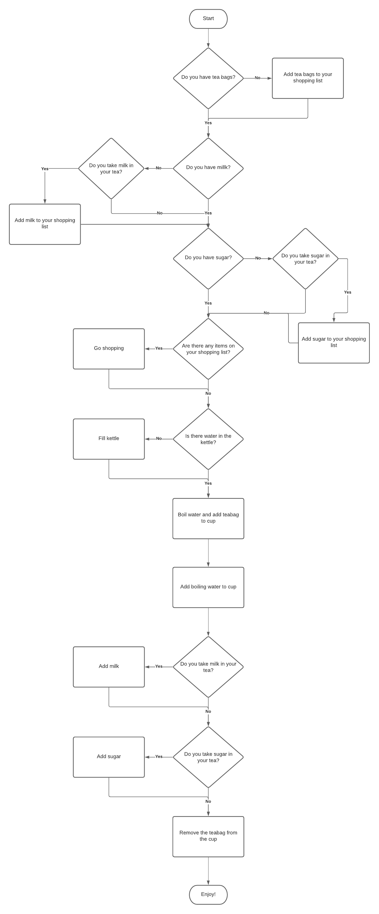

# Control Flow/Conditionals Lab 2

**Lab Duration: 90 minutes**

## Learning Objectives

- Practice translating a flowchart into code
- Practice pseudocode
- Practice conditional logic

## Task

Write a Python program based on the following flow chart.

### Brief

- All "procedure" symbols (rectangles) should be represented as `print` statements within your program.
- All "decision" symbols (diamonds) will require you take take input from the user, using `input`, and make a decision within your program using an `if` statement.

### Getting Started

1. Create a new file called `making_tea.py`
2. Write pseudocode based on the flowchart
3. Translate your pseudocode into working Python code
